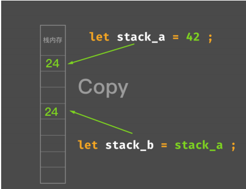
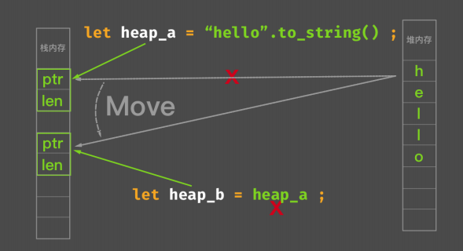

## 08.语法面面观：面向表达式（下)

## Rust表达式分类

- 位置表达式
- 值表达式

#### 位置表达式

- 静态变量初始化
  static mut LEVELS: u32 = 0;

- 解引用表达式
  *expr

- 数组索引表达式
  expr[expr]

- 字段表达式
   expr.field

- 以上和加上括号的位置表达式 
  (expr)

#### 值表达式

除了位置表达式，都是值表达式

## Rust所有权语义在表达式的体现

- Copy 语义  
Copy 语义代表可以安全在栈内存复制

- Move 语义  
Move 语义代表必须旧的绑定失效，避免内存不安全

堆内存分配，栈只存储指针，赋值则所有权转移

## Rust的不可变与可变

- 不可变绑定与可变绑定
- 不可变引用于可变引用

## 作业

1. 除了 let 赋值语句的值上下文之外，你还能找出哪些值上下文？
 请写一些代码示例去尝试一下