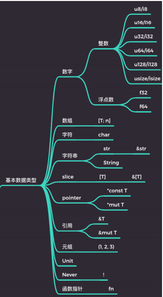

## 09.语法面面观：数据类型 （上）

## Rust中的类型

1. 基本数据类型
2. 自定义复合类型
3. 容器类型
4. 泛型
5. 特定类型

#### 基本数据类型

字符串使用场景->字符串类型

1. 字面量
2. 动态可增长字符串
3. 从一段字符串中截取的片段
4. 字符串编码
5. FFi 中需要转换字符串到 C 或 OS 本地字符串
6. 遵循特定格式的文件路径

#### Rust指针类型

- 原始指针
- NonNull指针
- 函数指针

#### 引用

&T 和 &mut T

#### Never类型

代表不可能返回值的计算类型

底类型：不包含任何值，但是他可以合一到任何其他类型

Never类型用 ！叹号表示

#### 复合类型

1. 结构体Struct
2. 枚举体 Enum
3. 联合体 Union

#### 结构体内存布局

会进行内存重排

[demo](..src/demo/09.rs)

[官方文档](https://doc.rust-lang.org/std/mem/fn.size_of.html)

#### 泛型

静态分发和turbefish

[demo](../src/demo/09_turbefish.rs)

#### 特定类型

有特殊用途的类型

1. PhantomData<T> 幻影类型
2. Pin<T> 固定类型

## 作业

1. 请自行阅读标准库文档，按课程中的类型分类，自己梳理一遍类型。
相信你能发现更细节的内容

