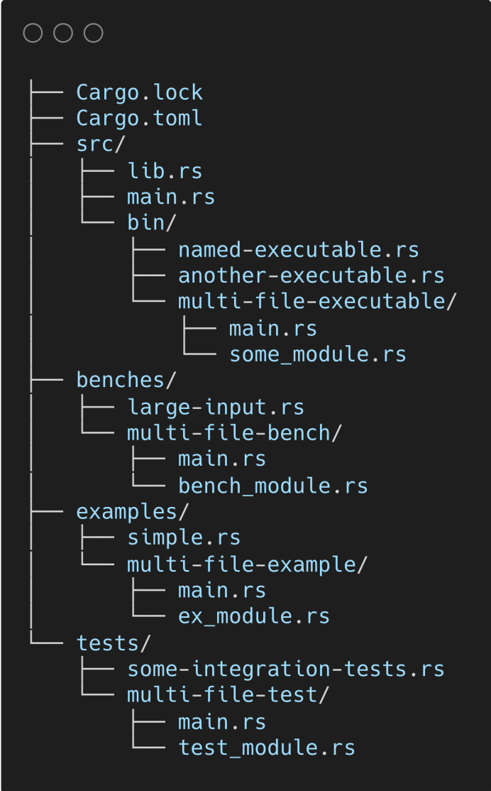

## 24.Rust语法面面观：Cargo包管理器（上）

## 什么是包

1. Package 和 crate 都是指 包
2. Package 是概念层的包，包含了单个或多个 crate
3. crate 是实际编译单元

## 什么是Cargo

1. 引入了 Cargo.toml 和 Cargo.lock 元数据文件
2. 提取并构建各种依赖包 
3. 使用正确的参数来调用 rustc 或 其他工具构建包
4. 引入了约定，使得使用 Rust 包更加容易

## 基本包结构

