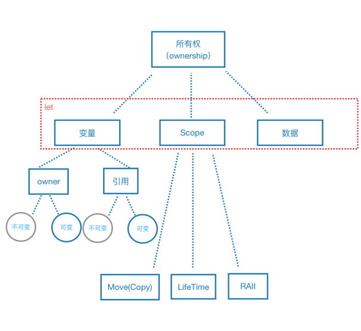

## 34.所有权：安全管理之内存安全

## 语义模型

比如： let answer = "42" 

变量 answer 就有了owner 和 引用，也有了作用域和数据 

## 类型系统之仿射类型

资源 最多只能被消耗一次

所以存在 Move 和Copy 语义

- Move  资源被消耗一次  默认为Move语义
- Copy  资源复制一次之后，进行消耗  要使用需要定义Copy trait

## 内存管理

1. 默认存储数据在栈上
2. 利用栈来自动管理堆内存(栈的变量被清空，那堆的内容也会被清空)

## 借用

1. 借用可以当成一个安全的指针
2. 引用是指向一个有效的数据，如果数据无效了，引用也失效了。

##  共享

1. 实现clone traint ，所有权共享
2. 实现方式：深拷贝和引用计数

